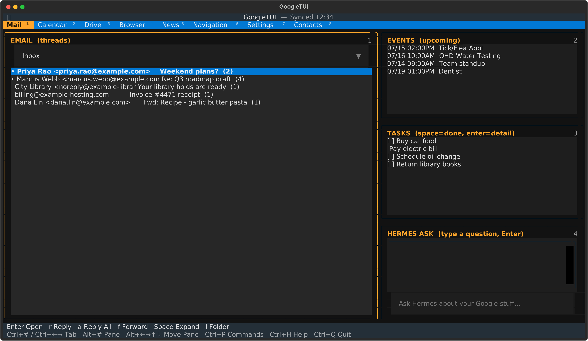

# google-tui

A multi-pane terminal UI (TUI) for your Google Workspace, built with
[Textual](https://textual.textualize.io/).



## Features

Eight full-width **tabs** live in the blue bar: **Mail**, **Calendar**,
**Drive**, **Browser**, **News**, **Navigation**, **Settings**, **Contacts**
(`Ctrl+1..8`). The Mail tab holds four **panes**: Email, Events, Tasks,
Hermes (`Alt+1..4`, or `Alt+arrows` to move relatively).

**Works offline, to a degree.** The app is cache-first: whatever it fetched
last time shows up instantly on launch, while it reconnects to Google in the
background (`Connecting…` → `Synced HH:MM` in the title bar). If it can't
reach Google at all, you still get your cached inbox, calendar, tasks, and
any Drive files you've previously viewed — the title bar shows `Offline
(cached HH:MM)`, and actions that need a live connection (reply, forward,
toggling a task) are disabled with a warning instead of failing silently.

- **Mail tab — Email pane** (left, full height): a label/folder picker
  (All Mail, system labels, nested user labels) above a threaded Gmail
  list with a lightbar. `l` jumps straight to the folder picker and opens
  it. `Enter` opens the full thread — HTML-heavy messages render as actual
  formatted HTML (bold, links, etc.) instead of stripped plain text;
  `Space` expands/collapses the highlighted row in place to show its
  snippet (and message count, for threads with more than one message)
  without leaving the list; `r` / `a` / `f` reply / reply-all / forward
  (compose modal, with a 5-second cancelable countdown before it actually
  sends). Unread threads are marked with a bullet.
- **Mail tab — Events pane** (upcoming): next ~3 weeks of events, lightbar,
  `Enter`/`Space` for detail.
- **Mail tab — Tasks pane:** all Google Task lists, lightbar. `Space` toggles
  complete, `Enter` shows details/subtasks.
- **Mail tab — Hermes pane:** type a question and `Enter`. Not locked into
  Hermes — pick Hermes (Nous LLM + agent), Claude Code, opencode, or
  Gemini CLI as your AI provider in Settings. Whichever you pick gets the
  same live Google context automatically; action-shaped questions are
  delegated to that provider's own agent/tool-use mode.
- **Calendar tab:** a full **Month** view (events listed inside each day's
  square, `+N more` overflow opens a modal with the day's full list) and a
  **Week** view (hour-grid, day columns, event blocks) — modeled on Google
  Calendar's web UI. `[` / `]` page the month or week.
- **Drive tab:** folder browser on the left; a live preview pane on the
  right shows file metadata (owner, type, path, created/modified) and, for
  non-binary/non-image files, a text preview. Files you've viewed are
  available offline too.
- **Browser tab:** an address bar that speaks `http(s)://`, `gopher://`,
  and `gemini://` (with TOFU cert trust), plus a Search mode for bare
  text (no scheme) via a configurable real search provider — Google
  (Custom Search JSON API), DuckDuckGo (no API key needed, the default
  fallback), or your own SearXNG instance, picked in Settings. A "new tab
  page" row of bookmark buttons (Google, Wikipedia, Gopherpedia, Gemini
  Protocol) sits under the address bar until you navigate anywhere, then
  disappears for the rest of the session. Numbered `[N]` links in the
  page — like every Gopher/Gemini menu and every search result — jump
  with digits + `Enter`. `Alt+Left/Right` are Back/Forward through this
  session's history (no re-fetching); `Tab` toggles focus between the
  address bar and the page.
- **News tab:** an RSS/Atom reader — entries from every feed you subscribe
  to (managed in Settings), combined into one lightbar list, newest first.
  `Enter`/`Space` opens an entry, rendered through the same shared
  Document view as the Browser tab.
- **Navigation tab:** driving directions via the Google Routes API — type
  free-text origin/destination addresses (no need for exact coordinates,
  the API geocodes them itself), hit `Enter` or the Go button, and get a
  total distance/duration plus a turn-by-turn step list. Export the current
  itinerary to a text file with the Export button (saved under
  `Documents/google-tui/`). Needs a Routes API key, set in the Settings
  tab's Navigation sub-tab — see [SETUP.md](SETUP.md) §6 for enabling the
  API and linking Cloud Billing (it's part of paid Google Maps Platform,
  unlike the other APIs this app uses).
- **Settings tab:** five sub-tabs (`Alt+Left/Right` cycles between them
  while the Settings tab is active) — **General** (a "Re-authorize Google
  account" button — shows a URL to open in any browser, on any device, and
  a place to paste back what you get; works with no browser and no display
  on the machine running google-tui, use it whenever a tab shows an auth
  error or roughly weekly since Google expires test-app tokens after 7
  days, see [SETUP.md](SETUP.md) §4 and §7; encrypt-at-rest for the local
  cache, off by default; choose how the encryption key is handled; clear
  the local cache), **AI Provider** (pick
  your AI provider, set a Nous API key), **News Feeds** (manage your
  News-tab feed subscriptions — add/remove URLs), **Search** (pick the
  Browser tab's search provider — Google/DuckDuckGo/SearXNG — and set the
  API key/Search Engine ID or instance URL it needs), and **Navigation**
  (set the Routes API key used by the Navigation tab) — all without
  hand-editing config files.
- **Contacts tab:** your Google Contacts, searchable live with fuzzy
  matching as you type. `Enter`/`Space` opens a contact's detail (name,
  email, phone) with a "Compose Email" button; a "Compose New" button
  starts a blank message. The same fuzzy match also powers a suggestion
  dropdown in Compose's To field as you type a name. Needs the
  `contacts.readonly` scope on your Google token — see
  [SETUP.md](SETUP.md) §7.

**First run with nothing configured?** google-tui still launches — an
onboarding wizard walks you through whatever's missing (Google account,
AI provider) instead of the normal tabs. See [SETUP.md](SETUP.md) for the
full Google Cloud Console walkthrough.

## Layout & keys

```
┌[Mail¹] Calendar² Drive³ Browser⁴ News⁵ Navigation⁶ Settings⁷ Contacts⁸ ── Synced 14:32 ┐  ← blue bar
├─ EMAIL ──────────────────────┐ ┌─ EVENTS ─────────────────────┤
│ ▸ Frank Krizan                │ │ ▸ 07/13 Tick/Flea Appt       │
│   Fwd: [DigiPi] …             │ │ ▸ 07/15 OHD Water Testing    │
│                                │ ├─ TASKS ──────────────────────┤
│                                │ │ [ ] Buy cat food             │
│                                │ │ [x] Pay electric bill        │
│                                │ ├─ HERMES ASK ─────────────────┤
│                                │ │ > ask a question, Enter      │
└────────────────────────────────┘ └───────────────────────────────┘
```

| Key | Action |
|-----|--------|
| `Ctrl+1..8` | switch tab (Mail / Calendar / Drive / Browser / News / Navigation / Settings / Contacts) |
| `Ctrl+Left/Right` | cycle tabs — use this if `Ctrl+1..8` doesn't reach the app (common in browser-based terminals, which reserve `Ctrl+1..8` for switching *their own* tabs) |
| `Alt+1..4` | jump to Mail pane (Email / Events / Tasks / Hermes) |
| `Alt+Left/Right/Up/Down` | move to the adjacent Mail pane; on the Browser tab, back/forward through history; on the Settings tab, cycle General/AI Provider/News Feeds/Search/Navigation |
| `Tab` / `Shift+Tab` | cycle Mail panes |
| `l` | open the folder/label picker (Email pane) |
| `r` `a` `f` | reply / reply-all / forward (Email pane, disabled while offline) |
| `Space` | contextual: expand/collapse the highlighted row in place, showing its snippet (Email), toggle complete (Tasks, disabled while offline), event detail (Events) |
| `Enter` | open selected item's detail |
| `[` `]` | previous / next month or week (Calendar tab) |
| `Ctrl+R` | reconnect / refresh all data |
| `Ctrl+P` | command palette |
| `Ctrl+H` | help (full keybinding reference) |
| `Ctrl+Q` / `Esc` | quit / close modal |

The layout is resize-reactive (Textual auto-reflows on terminal resize); the
bottom help bar wraps its own text if the terminal is narrow.

## Setup

Requires Python 3.11+. Uses a Google token at `~/.hermes/google_token.json`
(Gmail/Calendar/Drive/Tasks scopes) — see [SETUP.md](SETUP.md) for the full
Google Cloud Console walkthrough if you don't have one yet. For the Ask
pane, pick an AI provider in Settings; Hermes (the default) additionally
needs a Nous inference key, settable right there or in
`~/.hermes/config.yaml`.

```bash
cd google-tui
python3 -m venv --system-site-packages .venv
. .venv/bin/activate
pip install -e .
git config core.hooksPath hooks   # one-time: auto-installs new deps on `git pull`
google-tui          # launches the TUI
```

### Updating

`git pull` as usual. The `core.hooksPath` line above activates a tracked
`post-merge` hook (`hooks/post-merge`) that re-runs `pip install -e .`
automatically whenever a pull changes `pyproject.toml` — so a newly-declared
dependency (e.g. `feedparser` for the News tab) is installed before you next
launch `google-tui`, instead of crashing with `ModuleNotFoundError`. If you
cloned before this existed, run the `git config` line once to catch up.

## Project layout

```
google-tui/
├── pyproject.toml
├── google_tui/
│   ├── __init__.py
│   ├── __main__.py        # `python -m google_tui` entry
│   ├── gauth.py          # Google auth + Gmail/Cal/Tasks/Drive/Contacts/label helpers
│   ├── ask.py            # AIProvider abstraction (Hermes/Claude Code/opencode/Gemini CLI) + search
│   ├── render.py         # protocol-agnostic Document/Block/Link model + DocumentView
│   ├── fetchers.py       # HTTP/Gopher/Gemini fetch (Browser) + RSS/Atom feed fetch (News) + Routes API (Navigation)
│   ├── cache.py          # local SQLite cache, optional per-row encryption
│   ├── settings.py       # user preferences (settings.json)
│   ├── setup_instructions.py  # shared onboarding-wizard / SETUP.md text
│   └── main.py          # the Textual app, tabs, panes, and modals
├── README.md
└── SETUP.md              # Google Cloud Console walkthrough
```

## Notes

- The default Hermes provider calls `tencent/hy3:free` via the Nous endpoint
  (configurable in `ask.py`). Action-type questions shell `hermes` so the full
  agent (tools/skills) handles them; the Claude Code/opencode/Gemini CLI
  providers handle both plain and action-shaped questions the same way, via
  a one-shot CLI invocation.
- Replying/forwarding uses Gmail threads and sets In-Reply-To automatically.
- Drive plaintext rendering exports Google-native files (Docs→txt, Sheets→csv).
- News tab feeds are fetched with `feedparser`; add/remove subscriptions from
  the Settings tab. Entries are cached locally too, so previously-fetched
  headlines are still there next launch even before the background refresh
  finishes.
- Navigation tab driving directions use the Google Routes API (needs a
  billed Google Maps Platform key — see SETUP.md §6). Exported itineraries
  are plain-text files under `~/Documents/google-tui/` (via `platformdirs.
  user_documents_dir()`).
- Local cache lives at `~/.cache/google-tui/cache.db`; preferences at
  `~/.config/google-tui/settings.json` (both via `platformdirs`, so the
  actual path follows XDG conventions on Linux). Encryption is off by
  default; turn it on from the Settings tab. Small "browse" data (thread
  subjects, event/task summaries) is cached in bulk; larger content (email
  bodies aren't cached at all yet — only summaries; Drive file text) is
  cached lazily, only after you've actually viewed it once online, so
  encryption overhead never scales with your whole account, only with what
  you've looked at.
